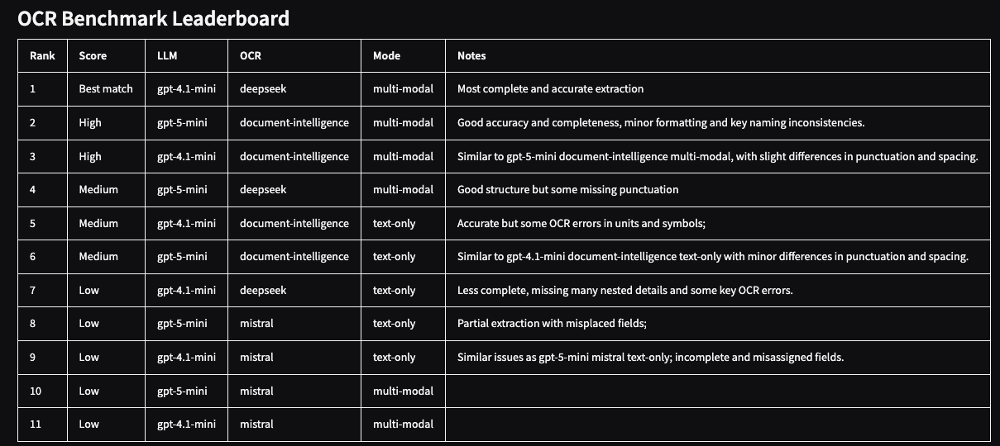

<div align="center">

# DeepSeek OCR & LLM Extraction 

**Assess and compare various OCR engines and LLM reasoning strategies for structured data extraction from multi-page documents.**

[Features](#features) • [Getting Started](#getting-started) • [Usage](#usage) • [Configuration](#configuration)

---


*(Example of the generated HTML leaderboard comparing extraction accuracy)*

</div>

## 🚀 Overview
This project provides a framework to evaluate the performance of different Optical Character Recognition (OCR) services (and techniques) combined with Large Language Models (LLMs) for extracting structured data from complex PDF documents.

By running the pipeline, you generate a comparative leaderboard that highlights:
- **OCR Quality:** How well different engines handle layout, tables, and multi-page context.
- **LLM Reasoning:** The ability of models to interpret OCR output (Markdown or Images) and conform to a specific schema.
- **Cost/Performance:** Insights into trade-offs between different multimodal and text-only approaches.

## ✨ Features

- **Multi-Engine Support:**
  - **DeepSeek OCR:** 
  - **Mistral Document AI:** 
  - **Azure Document Intelligence:** 
- **Flexible LLM Integration:** 
- **Modes:**
  - **Text-Only:** LLM receives OCR-generated Markdown.
  - **Multi-Modal:** LLM receives OCR-generated Markdown + Page Images.
- **Automated Judging:** Uses a "Judge" LLM to compare extraction results against a ground truth JSON.
- **Interactive UI:** Includes a Gradio web interface for running benchmarks and viewing results.
- **Caching:** Smart caching of OCR results to save time and API costs.

## 🛠️ Getting Started

### Prerequisites

- Python 3.10+
- `poppler-utils` (for PDF to image conversion)
- API Keys for the services you intend to test.

### Installation

1. Clone the repository.
2. Install dependencies:
   ```bash
   pip install -r requirements.txt
   ```

## ⚙️ Configuration

Create a `.env` file in the root directory with your API credentials:

```ini
# Azure OpenAI
AZURE_OPENAI_GPT41_ENDPOINT=...
AZURE_OPENAI_GPT41_DEPLOYMENT=...
AZURE_OPENAI_GPT41_API_KEY=...
AZURE_OPENAI_GPT41_API_VERSION=...

# OCR Services
DEEPSEEK_OCR_ENDPOINT=...
DEEPSEEK_OCR_API_KEY=...

MISTRAL_DOC_AI_ENDPOINT=...
MISTRAL_DOC_AI_KEY=...

DOCUMENTINTELLIGENCE_ENDPOINT=...
DOCUMENTINTELLIGENCE_KEY=...
```

### Deploying DeepSeek OCR

You can deploy the DeepSeek OCR engine as a scalable service within **Azure Container Apps (ACA)**. Please refer to the [`deepseek-ocr`](./deepseek-ocr) folder for specific deployment guides and container configuration to expose the compatible endpoint.

## 🖥️ Usage

### Command Line Interface

Run the full benchmark suite:
```bash
python app.py all
```

Run a specific scenario:
```bash
python app.py "gpt-4.1-mini/deepseek/text-only"
```

### Web Interface (Gradio)

Launch the interactive dashboard:
```bash
python gradio.py
```
Open your browser to the local URL provided to select scenarios and view the generated HTML leaderboard.

## 📂 Project Structure

- `app.py`: Core logic, OCR implementations, LLM clients, and pipeline orchestration.
- `gradio.py`: Web UI for the benchmark.
- `data/`: Place your input PDF (`input.pdf`) and expected JSON output (`expected_output.json`) here.
- `prompts/`: Contains the extraction prompt (`extraction_prompt.md`).
- `.artifacts/`: Stores cached OCR results, images, and the final report.

---

<div align="center">
  <sub>Built for robust document intelligence evaluation.</sub>
</div>
